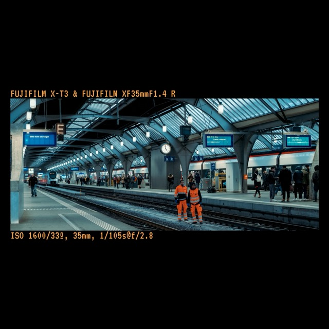

# Pixy, a databack inspired image formatter

So this is more of a toy than anything else, but pull requests and feature suggestions are appreciated.

Lightroom CC has a baffling omission for plugins, I needed something to add borders to images, I decided I wanted it to display metadata in the same way that a 90s style databack for a film camera would do.

I think it looks quite nice, however, most of this is built on hacks -- but it's a little project I worked on during a train ride, so what can you do? (The answer is pull requests).

The code is relatively stable, but there isn't much in the way of error handling, but it has arguments and can process batches of images using wildcards, etc.

Here is an example image:

Yes, there are Ace Combat references, I thought it was funny at the time. No, I'm not removing them.

The font used is [VT323](https://fonts.google.com/specimen/VT323/about), credit to Peter Hull.